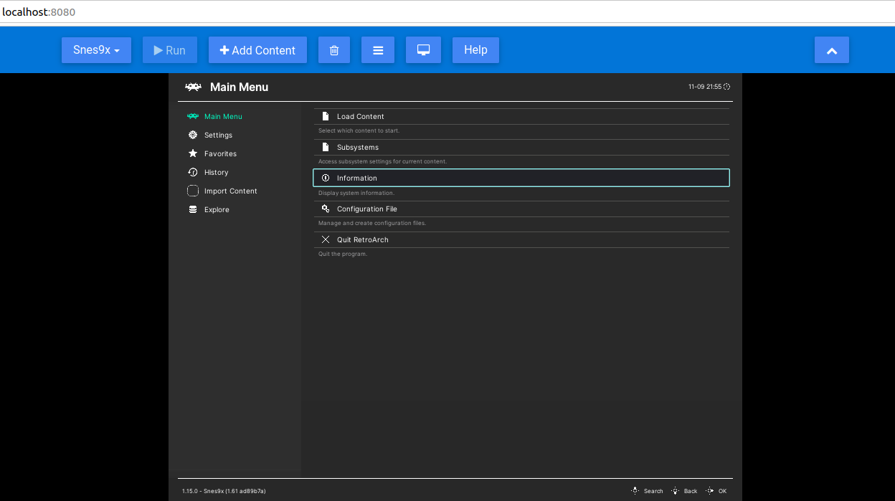

[](https://github.com/humbertodias/docker-retroarch-web/actions/workflows/deploy.yml)

# Retroarch Web

[Retroarch-web](https://hub.docker.com/r/hldtux/retroarch-web) container buildable by type/version

New stable/nightly versions on https://buildbot.libretro.com

## Run

```shell
RETROARCH_TYPE=stable
RETROARCH_VERSION=1.15.0
docker run --rm -p 8080:80 hldtux/retroarch-web:$RETROARCH_TYPE.$RETROARCH_VERSION
```
Then access

http://localhost:8080

and



1. Select the core
2. Hit Play
3. Add content and upload your rom game
4. Load content > Start Directory
5. Select the rom and finally the core to start
